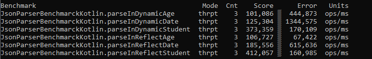

Para comparar o desempenho do método parse entre as classes JsonParserReflect e JsonParserDynamic
implementamos um teste de desempenho benchmark para cada um em 3 casos especifícos: Uma data class só com propriedades do tipo primitivo (Date),
uma data class com tipos primitivos e de referência (Student), uma data class apenas com tipos de referência (Age). Estes testes foram realizados
num computador com processador i5 de 8ª geração.

Como é observado no exemplo acima, para qualquer data class, o parse dinâmico tem um melhor desempenho relativamente ao tempo em comparação com o reflect. 
Estes resultados devem-se ao fato do reflect ter uma abordagem mais geral quanto ao parse de um objeto enquanto o dynamic tem uma abordagem mais concreta para cada objeto.